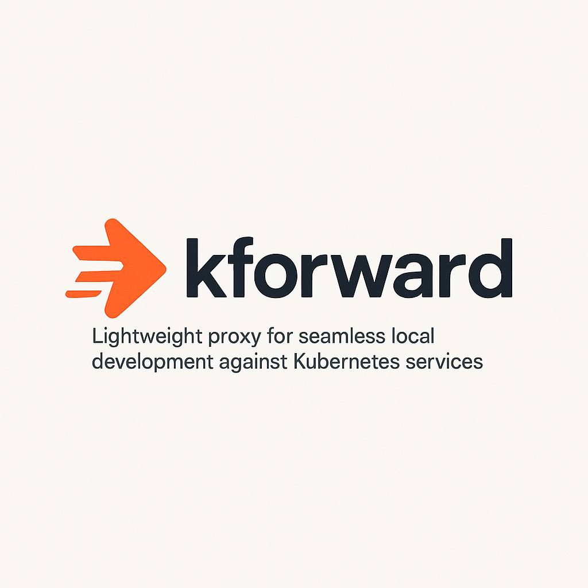

<p>
  
  <!-- width="200" 값은 로고 크기에 맞게 조절하세요 -->
</p>

# kforward

<a href="https://www.producthunt.com/posts/kforward?embed=true&utm_source=badge-featured&utm_medium=badge&utm_souce=badge-kforward" target="_blank"></a>

[](https://golang.org/) <!-- Update Go Version if needed -->
[]() <!-- TODO: Replace with actual CI badge -->
[](LICENSE)

**kforward** is a lightweight, simple CLI tool designed to streamline local development for applications interacting with Kubernetes services. Built with Go, it allows you to easily access services running inside your cluster using their standard service names, without the hassle of managing multiple `kubectl port-forward` sessions.

## 🤔 Why kforward?

Developing applications locally that need to communicate with services inside a Kubernetes cluster often involves friction:

*   **Tedious Port-Forwarding:** Managing multiple `kubectl port-forward` commands in separate terminals for each required service is cumbersome, error-prone, and doesn't scale well.
*   **Configuration Changes:** Hardcoding `localhost:PORT` addresses in local configurations is inconvenient and differs from how the application runs in the cluster.
*   **Complex Alternatives:** Tools like Telepresence or mirrord are powerful but can be complex to set up, require specific cluster configurations, or might be overkill for simply accessing internal services.

**kforward aims to address these challenges by providing a simpler approach:**

*   **🚀 Simple & Reliable:** Provides a straightforward local HTTP proxy interface while using the battle-tested `kubectl port-forward` for the actual tunneling.
*   **kubectl Automation:** Automatically finds target pods and manages the lifecycle of required `kubectl port-forward` processes for specified services or entire namespaces.
*   **📦 Single Binary:** The `kforward` tool itself is a single static Go binary, easy to install and run. **(Note: Requires `kubectl` to be installed and available in your PATH).**
*   **🌐 Use Native Service Names:** Allows your local application to use standard Kubernetes service DNS names (e.g., `my-service.my-namespace.svc.cluster.local`) without code changes, just by configuring the proxy.
*   **✅ Improved Developer Experience:** Reduces the friction of managing port forwards manually, making local development against Kubernetes smoother and less error-prone.

By automating `kubectl port-forward` management behind a simple proxy, kforward helps developers **focus on coding**, **reduce configuration errors**, and **maintain consistency** between local and cluster environments.

## ✨ Features

*   **CLI Interface:** Simple command-line interface to start the proxy and specify targets.
*   **Kubeconfig Autodetection:** Automatically uses your currently configured `kubectl` context.
*   **Context Override:** Supports specifying a Kubernetes context via the `--context` flag.
*   **kubectl Process Management:**
    *   Automatically finds ready pods for specified services.
    *   Starts `kubectl port-forward` processes in the background for required services/ports.
    *   Manages and terminates these background `kubectl` processes gracefully when `kforward` exits.
*   **Targeted Service Forwarding:** Manages forwards for one or more specific services (`namespace/service-name`).
*   **Namespace-Wide Forwarding:** Manages forwards for all non-headless services and their ports within a specified namespace.
*   **Local HTTP Proxy:** Runs a local proxy server (default port `1080`) that handles:
    *   Standard HTTP requests.
*   **Dynamic Connection Routing:** Routes incoming proxy requests to the correct background `kubectl port-forward` process based on the requested service name and port.
*   **Configurable Proxy Port:** Allows specifying a different local port for the HTTP proxy server using the `--port` flag.

## 🏗️ Architecture

kforward runs as a **local Go process** that acts as a central manager and proxy. It uses `client-go` to query the Kubernetes API and `os/exec` to launch and manage `kubectl port-forward` processes. Your local application connects to the kforward proxy, which then routes traffic through the appropriate `kubectl` tunnel.
```text
+------------------------------------------+      +--------------------------------+      +-------------------------+
|            Your Local Machine            |      |      Kubernetes Cluster        |      |   Target Pod (in K8s)   |
|                                          |      |                                |      |                         |
|  +----------------+                      |      |  +-------------------------+   |      |  +-------------------+  |
|  | Your Local App |--------------------->|----->|  | kforward HTTP Proxy     |   |      |  | Your App's Backend|  |
|  | (e.g., my-app) |                      |      |  | (Go Process)            |   |      |  | (e.g., Port 8080) |  |
|  | Configured with|                      |      |  | Listens on :1080        |   |      |  +---------^---------+  |
|  | proxy settings |                      |      |  +-----------+-------------+   |      |           | kubectl tunnel|
|  +----------------+                      |      |              |                 |      |           | established |
|                                          |      |              | Uses            |      +-----------+-----------+
|                                          |      |              | manager to find |                  ^
|                                          |      |              | local port map  |                  |
|                                          |      |              v                 |                  |
|                                          |      |  +-----------+-------------+   |                  |
|  +------------------+<-------------------|------|  | kubectl port-fwd Proc 1 |<--+ K8s API Server   |
|  | localhost:10001  | Dials local port   |      |  | (Background Process)    |---| (Port Forward)   |
|  +------------------+                    |      |  +-------------------------+   |                  |
|                                          |      |                                |                  |
|  +------------------+                    |      |  +-------------------------+   |                  |
|  | localhost:10002  |<-------------------|------|  | kubectl port-fwd Proc 2 |<--+  K8s API Server  |
|  +------------------+                    |      |  | (Background Process)    |---| (Port Forward)   |
|        ^                                 |      |  +-------------------------+   |
|        | kforward Manager starts         |      +--------------------------------+
|        | & manages these kubectl processes |
|        | based on user flags.              |
+------------------------------------------+
```
**Key Components & Flow:**

1.  **kforward Application (Local Host):**
    *   Runs directly on your machine (`./kforward`).
    *   Starts a local **HTTP proxy** server (e.g., on `localhost:1080`).
    *   Uses your `kubeconfig` and `client-go` to connect to the **Kubernetes API Server** to get service/pod information.
    *   Based on the `--namespace` or `--service` flags, the **Manager** component identifies necessary port forwards.
    *   For each required forward, the Manager **launches a `kubectl port-forward pod/... <local-port>:<pod-port>` command** as a background process. It keeps track of which service/port maps to which local port (e.g., `10001`, `10002`).
2.  **Local Development Application (`my-app`):**
    *   Your application that needs to talk to K8s services.
    *   Configured to use the kforward HTTP proxy (e.g., via `export http_proxy=http://localhost:1080`).
    *   Makes requests using the **standard Kubernetes service DNS name** (e.g., `http://hello-app-service.default.svc.cluster.local`).
3.  **Request Handling:**
    *   The request from `my-app` is directed to the local `kforward` proxy (`localhost:1080`).
    *   The **HTTP Proxy** component receives the request.
        *   It identifies the target Kubernetes service (e.g., `hello-app-service.default`) and port (e.g., 80).
        *   It asks the **Manager** for the local port that corresponds to this target (e.g., `10001`).
        *   The proxy then **dials the local port** (`localhost:10001`).
    *   The background **`kubectl port-forward` process** listening on `localhost:10001` receives this connection.
    *   `kubectl` handles the secure tunneling through the **K8s API Server** to the actual Pod (e.g., `hello-app-deployment-xxxx:8080`).
    *   The response travels back through the `kubectl` tunnel, to the `kforward` proxy, and finally to your `my-app`.

---
## 🚀 Getting Started

This guide helps you install and run `kforward` locally to access services in your existing Kubernetes cluster using Homebrew.

**1. Prerequisites:**

*   **Homebrew:** Must be installed on your macOS or Linux system. ([Installation Guide](https://brew.sh/))
*   **`kubectl`**: Required by `kforward` to interact with your cluster. If you don't have it, **Homebrew will install it automatically** when you install `kforward`. You can verify your `kubectl` installation afterwards with `kubectl version --client`.
*   **A Kubernetes cluster:** (e.g., Minikube, Kind, Docker Desktop K8s, or a remote cluster) accessible via your `kubectl` configuration.

**2. Install kforward using Homebrew:**

*   Open your terminal and run the following commands:

    ```bash
    # 1. Add the kforward Tap (only needed once)
    brew tap sanspareilsmyn/kforward

    # 2. Install kforward (this will also install kubectl if needed)
    brew install kforward
    ```
*   **Updating kforward:** To get the latest version in the future, run:
    ```bash
    brew upgrade kforward
    ```

**3. Deploy a Test Service (if needed):**

*   To test `kforward`, you need a service running in your cluster. If you don't have one, you can deploy the example `hello-app`:
    *   Clone the `kforward` repository (optional, just to get the example file):
        ```bash
        # You don't need the full source code just to run kforward if installed via brew
        # But you might want it for the examples
        git clone https://github.com/sanspareilsmyn/kforward.git
        cd kforward
        ```
    *   Apply the example manifest:
        ```bash
        kubectl apply -f examples/hello-app.yaml [-n your-namespace]
        ```
*   Verify the deployment and service are running:
    ```bash
    kubectl get deployment hello-app-deployment [-n your-namespace]
    kubectl get service hello-app-service [-n your-namespace]
    ```

**4. Run kforward:**

*   Start the proxy, specifying the target namespace or service(s). Keep this terminal running.
*   **Use `--context` if your desired cluster isn't the default.** Find contexts with `kubectl config get-contexts`.
    ```bash
    # Example 1: Manage forwards for all services in 'default' namespace using 'docker-desktop' context
    kforward proxy --context docker-desktop --namespace default --port 1080
    ```
    ```bash
    # Example 2: Manage forward for only 'hello-app-service' in 'default' namespace
    kforward proxy --context docker-desktop --service default/hello-app-service --port 1080
    ```
*   Watch the logs. You should see:
    *   Confirmation of the Kubernetes context being used.
    *   Messages indicating `kubectl port-forward` processes are being started (e.g., `Starting kubectl process: ...`).
    *   The HTTP Proxy server listening message (e.g., `Starting HTTP proxy server on :1080`).

**5. Configure Your Client Environment:**

*   In **a separate terminal**, set the `http_proxy` environment variables (lowercase recommended).
    ```bash
    # If kforward is running on port 1080
    export http_proxy="http://localhost:1080"
    ```
    *   **Alternatively (Command-Specific):** Prefix your command directly:
        ```bash
        http_proxy="http://localhost:1080" curl ...
        ```
    *   **Alternatively (curl direct flag):** Use `curl -x http://localhost:1080 ...`

**6. Test the Connection:**

*   From the **terminal where you set the proxy environment variables**, use `curl` (or your browser/application) to access the service using its Kubernetes DNS name.
    ```bash
    # Test hello-app-service (HTTP on service port 80 in default namespace)
    curl http://hello-app-service.default.svc.cluster.local

    # Test another service (replace names/ports/namespaces accordingly)
    # curl http://my-api.my-namespace.svc.cluster.local:8080
    ```
*   Check the `kforward` logs (first terminal) for activity: `Received request`, `Rewriting request`, `DialContext called`, `Found local forward address`, `Successfully dialed`.
*   You should receive the correct response in your `curl` terminal (e.g., the "Hello, world!" message from `hello-app`).

**7. Stopping kforward:**

*   Go back to the first terminal (where `kforward proxy` is running) and press `Ctrl+C`.
*   `kforward` should log that it's stopping the proxy server and terminating the background `kubectl` processes.
*   In the second terminal, unset the proxy environment variables if you used `export`:
    ```bash
    unset http_proxy no_proxy
    ```
---
## 🙌 Contributing

We welcome contributions! Please see `CONTRIBUTING.md` for details on how to contribute.

---

## 📄 License

Licensed under the Apache License, Version 2.0. See [LICENSE](LICENSE) for the full license text.
